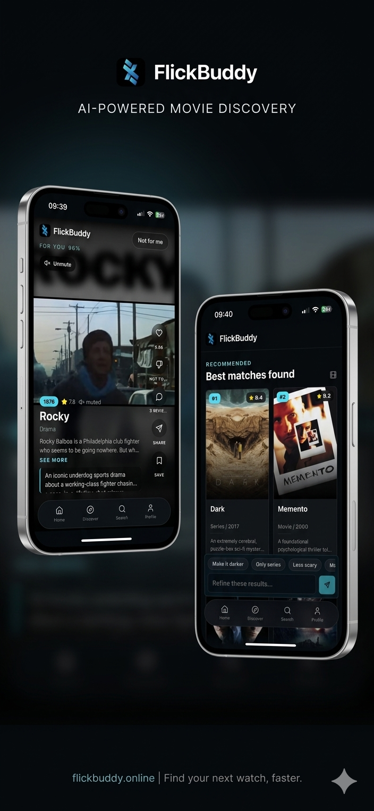

# FlickBuddy

FlickBuddy is a Next.js movie and series discovery app. It combines TMDB data
with AI-assisted ranking, taste profiles, lists, and shareable movie pages.



## Demo Video

[](https://www.youtube.com/shorts/Mr4gXjDQgKY)

## Features

- AI-assisted discovery and ranking
- TMDB search, trending, popular, recommendations, reviews, trailers, and images
- Taste onboarding and saved taste profiles
- Auth with email/password and optional Google sign-in
- Personal lists and public share links
- SQLite-backed local development
- Pluggable AI providers for self-hosted deployments

## Requirements

- Node.js 20+
- npm
- A TMDB API key
- An API key for at least one supported AI provider

## Quick Start

```bash
npm install
cp .env.local.example .env.local
npm run dev
```

Open `http://localhost:3000`.

## Environment

Set these first:

```bash
TMDB_API_KEY=
BETTER_AUTH_SECRET=replace-with-a-long-random-secret
NEXT_PUBLIC_APP_URL=http://localhost:3000
BETTER_AUTH_URL=http://localhost:3000
DATABASE_PATH=./data/FlickBuddy.sqlite
```

Then choose an AI provider:

```bash
AI_PROVIDER=openai
AI_MODEL=gpt-4.1
OPENAI_API_KEY=
```

Supported `AI_PROVIDER` values:

- `openai`
- `anthropic`
- `google`
- `azure-openai`
- `azure-ai`
- `openrouter`
- `ollama`

See `.env.local.example` for all provider-specific variables.

## AI Provider Notes

All provider calls happen server-side in `src/lib/ai.ts`. Do not expose AI keys
with `NEXT_PUBLIC_*`.

For local models, set:

```bash
AI_PROVIDER=ollama
AI_MODEL=llama3.1
OLLAMA_BASE_URL=http://localhost:11434/v1
```

For OpenRouter, set:

```bash
AI_PROVIDER=openrouter
AI_MODEL=openai/gpt-4.1
OPENROUTER_API_KEY=
```

For Azure OpenAI, set:

```bash
AI_PROVIDER=azure-openai
AI_MODEL=gpt-4.1
AZURE_OPENAI_KEY=
AZURE_OPENAI_ENDPOINT=
AZURE_OPENAI_API_VERSION=
AZURE_OPENAI_DEPLOYMENT=
```

## Development

```bash
npm run dev
npm run build
```

SQLite databases are created under `data/` by default and are ignored by Git.

## Contributing

Read `CONTRIBUTING.md` before opening a pull request.

## Security

Read `SECURITY.md` before reporting vulnerabilities or changing API-key,
authentication, authorization, or data-access code.

## License

MIT
